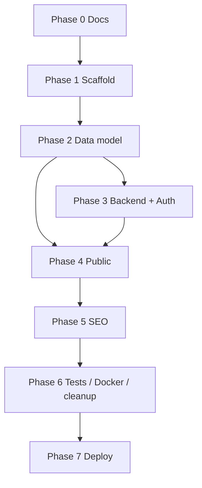

# Implementation Plan — car-retail

Phased plan for the **TypeScript rework**. Stack of record: [techstack.md](./techstack.md) and `.cursor/rules/nextjs-developer.mdc`. Ignore archived “no TypeScript / Redis / HMAC cookie” v1 language.

---

## Phase 0 — Documentation & conventions

| # | Task | Output |
|---|------|--------|
| 0.1 | Project context (+ admin spec + asset checklist) | `docs/project-context.md` ✓ |
| 0.2 | Tech stack (TS rework) | `docs/techstack.md` ✓ |
| 0.3 | Implementation plan | `docs/implementation-plan.md` ✓ |
| 0.4 | Cursor rules | `.cursor/rules/nextjs-developer.mdc` ✓ |

---

## Phase 1 — Scaffold & infrastructure ✓

| # | Task | Details |
|---|------|---------|
| 1.1 | Next.js App Router + TypeScript | `web/src/app/[locale]/`, `web/src/app/admin/`, strict TS |
| 1.2 | Prisma + PostgreSQL | `web/prisma/schema.prisma`, `src/server/db/prisma.ts` |
| 1.3 | Env | Zod fail-fast `src/server/config/env.ts` · `web/.env.example` |
| 1.4 | Docker | `web/Dockerfile` (standalone, Node 24) · root `docker-compose.yml` (`app` + `migrate`) |
| 1.5 | R2 client | `src/server/storage/r2.ts` from `STORAGE_S3_*` |
| 1.6 | Cache | Tag registry + `cachedRead` / `revalidateTags` only — no Redis / Map cache |
| 1.7 | i18n | next-intl, `messages/vi.json` + `en.json`, localized pathnames |

**Exit criteria:** `docker compose` builds app; Prisma connects via env; R2 client initializes.

---

## Phase 2 — Data model ✓

| # | Entity | Key fields |
|---|--------|------------|
| 2.1 | `site_settings`, `hotlines`, `menu_items` | `{ vi, en }` text |
| 2.2 | `units` | `{ key, value: { vi, en } }` |
| 2.3 | `attribute_keys` / `attribute_templates` | catalog + JSON items |
| 2.4 | `vehicle_lines`, `segments`, `vehicle_models`, `variants` | bilingual + attributes JSON |
| 2.5 | CMS content | feature sections, FAQs, hero, services, news, pages, policies |
| 2.6 | `showrooms`, `leads`, `media_assets` | leads include `locale` |
| 2.7 | Auth tables | `AdminUser`, Auth.js `Account` / `Session` / `VerificationToken` |

**Migrations:** `web/prisma/migrations/20260715120000_init`

**Seed:** `web/prisma/seed.ts` — generic models; units; templates; admin from `SEED_ADMIN_EMAIL` / `SEED_ADMIN_PASSWORD`.

```bash
cd web
npm run db:deploy   # or db:migrate for dev
npm run db:seed
```

---

## Phase 3 — Backend modules + Auth.js ✓

Layered `transport → service → repository` under `src/server/modules/*`.

| # | Area | Status |
|---|------|--------|
| 3.1 | Auth.js v5 + RBAC | ✓ DB sessions, `requireAdmin`, roles |
| 3.2 | Vehicles / attributes / templates | ✓ + `revalidateTag` on writes |
| 3.3 | Leads | ✓ create, list, status, CSV; rate limit on POST |
| 3.4 | Content / homepage / news / pages | ✓ |
| 3.5 | Showrooms / settings / media (R2) | ✓ |
| 3.6 | Public REST | ✓ health, models `[slug]`, leads |

**Admin UI:** contract surface = Server Actions + DTOs. Minimal unstyled pages for login / create-model / leads smoke; full CMS UI is frontend-owned (CSS Modules).

---

## Phase 4 — Public site ✓

| # | Page | Status |
|---|------|--------|
| 4.1–4.10 | Layout, home, model, test drive, deposit, news, about, contact, policies, FAQ | ✓ TS pages under `src/app/[locale]/` |

**API:** `GET /api/models/[slug]?locale=vi|en` → `{ units, attributes }`.

---

## Phase 5 — SEO & polish ✓

| # | Task | Status |
|---|------|--------|
| 5.1 | Per-locale meta | ✓ |
| 5.2 | `hreflang` + canonical | ✓ |
| 5.3 | Sitemap / robots | ✓ `src/app/sitemap.ts`, `robots.ts` |
| 5.4 | OG images from media | ✓ |
| 5.5 | Legal assets review | checklist in `project-context.md` |

---

## Phase 6 — Tests, Docker, docs, cleanup ✓

| # | Task | Details |
|---|------|---------|
| 6.1 | Vitest | Service/repo critical paths (leads, vehicles, RBAC, env, rate-limit, password) |
| 6.2 | Playwright | Auth login → create model action → public API; lead POST → admin list; rate-limit 429 |
| 6.3 | Docker | Standalone TS image; `migrate` = `prisma migrate deploy` |
| 6.4 | Docs / env | `techstack.md`, this plan, `.env.example` (`AUTH_SECRET`, `SEED_ADMIN_*`) |
| 6.5 | Cleanup | Remove superseded JS (`_legacy_app`, `web/lib/**.js`, HMAC admin, smoke/scrape scripts) |

---

## Phase 7 — Deploy (VPS)

| # | Step | Status |
|---|------|--------|
| 7.1 | VPS layout | `docs/deploy-checklist.md` |
| 7.2 | Env from examples | `web/.env.example`, `deploy.env.example` |
| 7.3 | Compose | `app` + `migrate` only |
| 7.4 | Verify | health / routes / admin / R2 |

---

## Route map

| Page | vi | en |
|------|----|----|
| Home | `/vi` | `/en` |
| Model | `/vi/models/[slug]` | `/en/models/[slug]` |
| Test drive | `/vi/dang-ky-lai-thu` | `/en/book-test-drive` |
| Deposit | `/vi/dat-coc` | `/en/deposit` |
| News | `/vi/tin-tuc` | `/en/news` |
| About | `/vi/ve-chung-toi` | `/en/about` |
| Contact | `/vi/lien-he` | `/en/contact` |
| Policies | `/vi/chinh-sach` | `/en/policies` |
| Support | `/vi/ho-tro` | `/en/support` |
| Admin | `/admin` | `/admin` |

---

## Dependency graph



---

## Related docs

- [project-context.md](./project-context.md)
- [techstack.md](./techstack.md)
