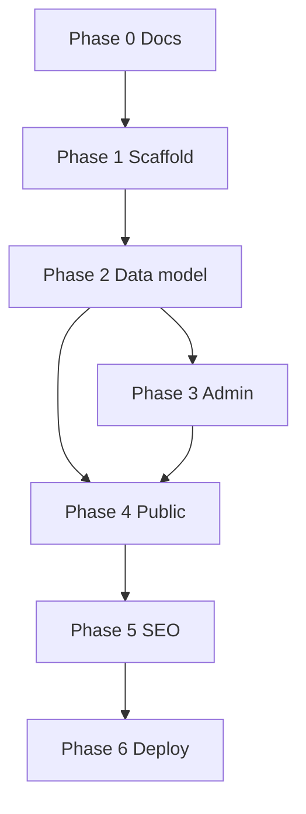

# Implementation Plan — car-retail

Phased build plan for v1. See [project-context.md](./project-context.md) and [techstack.md](./techstack.md).

---

## Phase 0 — Documentation & conventions

| # | Task | Output |
|---|------|--------|
| 0.1 | Project context (+ admin spec + asset checklist) | `docs/project-context.md` ✓ |
| 0.2 | Tech stack doc | `docs/techstack.md` ✓ |
| 0.3 | Implementation plan | `docs/implementation-plan.md` ✓ |
| 0.4 | Cursor rules | `.cursor/rules/car-retail-nextjs.mdc` ✓ |

---

## Phase 1 — Scaffold & infrastructure

| # | Task | Details |
|---|------|---------|
| 1.1 | Init Next.js | App Router, JavaScript, CSS Modules, `web/app/[locale]/`, `web/app/admin/` |
| 1.2 | Prisma + PostgreSQL | `web/prisma/schema.prisma`, `web/lib/prisma.js`, `DATABASE_URL` |
| 1.3 | Env templates | `web/.env.example`, `deploy.env.example` — all external services |
| 1.4 | Docker | `web/Dockerfile`, root `docker-compose.yml` (`app` + `migrate`), `web/.dockerignore` |
| 1.5 | R2 client | `web/lib/r2.js` from `STORAGE_S3_*` env |
| 1.6 | Cache helper | `web/lib/cache.js` — Map + TTL; no Redis |
| 1.7 | i18n setup | next-intl, `messages/vi.json`, `messages/en.json`, pathnames map |

**Exit criteria:** `docker compose up --build` starts app; Prisma connects via env; R2 client initializes.

---

## Phase 2 — Data model

| # | Entity | Key fields | Status |
|---|--------|------------|--------|
| 2.1 | `site_settings`, `hotlines`, `menu_items` | `{ vi, en }` text | ✓ |
| 2.2 | `units` | `{ key, value: { vi, en } }` | ✓ |
| 2.3 | `attribute_keys` | seed catalog | ✓ |
| 2.4 | `attribute_templates` | `items: [{ key, unit, defaultValue, showInStrip, sortOrder, groupKey }]` | ✓ |
| 2.5 | `vehicle_lines`, `segments`, `vehicle_models`, `variants` | bilingual descriptions + slugs | ✓ |
| 2.6 | `vehicle_attributes` | JSON `[{ key, value, unit }]` on model/variant | ✓ |
| 2.7 | `feature_sections`, `model_faqs`, `hero_slides`, `service_blocks` | CMS content | ✓ |
| 2.8 | `news_posts`, `pages`, `policy_documents`, `faq_items` | bilingual + slugs | ✓ |
| 2.9 | `showrooms`, `leads`, `media_assets` | leads include `locale` | ✓ |
| 2.10 | `admin_users`, `roles` | auth | ✓ |

**Migrations:** `web/prisma/migrations/20250710120000_init` — full schema (replaces AppMeta placeholder).

**Seed:** `web/prisma/seed.js` — generic models (City EV Compact, Family SUV Electric, etc.); units; templates (`electric-suv-standard`, `electric-mpv-standard`, `commercial-van`).

**Run locally:**
```bash
cd web
npx prisma migrate deploy   # or db:migrate for dev
npm run db:seed
```

---

## Phase 3 — Admin panel (`/admin`) ✓ (MVP)

| # | Module | Status |
|---|--------|--------|
| 3.1 | Auth | ✓ HMAC session cookie, login/logout, role guard |
| 3.2 | Site settings | ✓ dealer/legal/MST/consent/maintenance |
| 3.3 | Units catalog | ✓ list + create |
| 3.4 | Attribute templates | ✓ list + create (JSON items) |
| 3.5 | Vehicle catalog | ✓ list/create/edit models; variants read-only |
| 3.6 | Media library | ✓ R2 upload, list (delete API ready) |
| 3.7 | Homepage CMS | ✓ hero slides + service blocks |
| 3.8 | News | ✓ CRUD |
| 3.9 | Static pages | ✓ about/contact + FAQ + policies create |
| 3.10 | Showrooms & hotlines | ✓ CRUD |
| 3.11 | Leads inbox | ✓ list, status update, CSV export |
| 3.12 | Translation UX | ✓ VN/EN fields + missing-en badge |

**Deferred (v1.1):** variant bulk import, menu route validator, password reset, user admin.

**Cache bust:** `revalidateTag` on CMS writes via `lib/admin/revalidate.js`.

---

## Phase 4 — Public site ✓

| # | Page | Status |
|---|------|--------|
| 4.1 | Layout shell | ✓ Header, footer, locale switcher |
| 4.2 | Home | ✓ |
| 4.3 | Model detail | ✓ |
| 4.4 | Test drive | ✓ |
| 4.5 | Deposit | ✓ |
| 4.6 | News list + detail | ✓ |
| 4.7 | About | ✓ |
| 4.8 | Contact | ✓ |
| 4.9 | Policies | ✓ |
| 4.10 | FAQ | ✓ |

**API:** `GET /api/models/[slug]?locale=vi|en` → `{ units, attributes }`.

---

## Phase 5 — SEO & polish ✓ (partial)

| # | Task | Status |
|---|------|--------|
| 5.1 | Per-locale meta title/description | ✓ layout + model pages |
| 5.2 | `hreflang` + canonical URLs | ✓ metadata alternates + next-intl middleware |
| 5.3 | Sitemap (`/vi/*`, `/en/*`) | ✓ `app/sitemap.js` + `robots.js` |
| 5.4 | OG images from admin | ✓ `ogImageMediaId` in SEO defaults + model hero + news featured |
| 5.5 | Legal assets review before deploy | manual sign-off (`docs/project-context.md` checklist) |

---

## Phase 6 — Deploy (VPS)

| # | Step | Status |
|---|------|--------|
| 6.1 | VPS directory structure | documented in `docs/deploy-checklist.md` |
| 6.2 | Env from examples | ✓ `web/.env.example`, `deploy.env.example` |
| 6.3 | Clone + compose | ✓ `docker-compose.yml` (`app` + `migrate`) |
| 6.4 | Deploy command | documented |
| 6.5 | Verify health/routes/admin/R2 | checklist in `docs/deploy-checklist.md` |

**Note:** Actual VPS deploy requires user secrets and networks — not run from dev agent.

---

## Route map (quick reference)

| Page | vi | en |
|------|----|----|
| Home | `/vi` | `/en` |
| Model | `/vi/models/[slug]` | `/en/models/[slug]` |
| Test drive | `/vi/dang-ky-lai-thu` | `/en/book-test-drive` |
| Deposit | `/vi/dat-coc` | `/en/deposit` |
| News | `/vi/tin-tuc` | `/en/news` |
| About | `/vi/ve-chung-toi` | `/en/about` |
| Contact | `/vi/lien-he` | `/en/contact` |
| Policies | `/vi/chinh-sach` | `/en/policies` |
| Support | `/vi/ho-tro` | `/en/support` |
| Admin | `/admin` | `/admin` |

---

## v1.1 backlog

- Used-car inventory (`/vi/xe-cu` ↔ `/en/used-cars`)
- Careers page
- Service appointment booking
- Reviews widget
- National showroom map locator
- Per-locale news slug auto-derivation improvements

---

## Dependency graph



---

## Related docs

- [project-context.md](./project-context.md)
- [techstack.md](./techstack.md)
